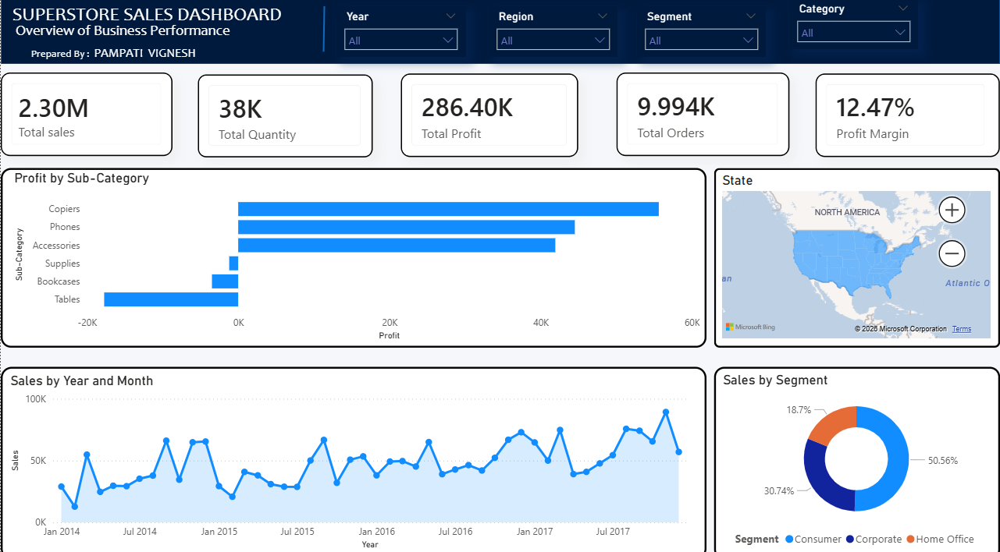
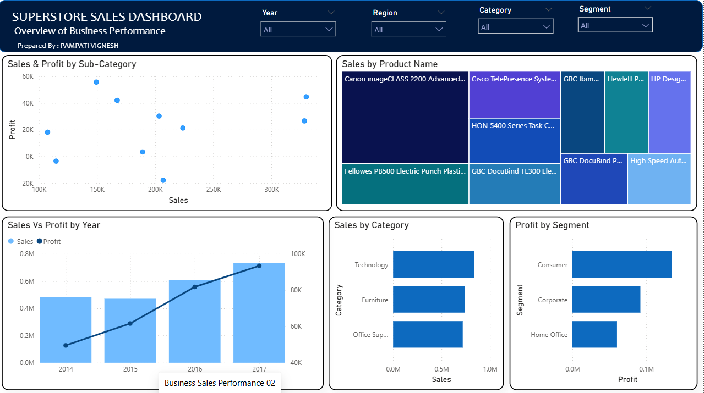
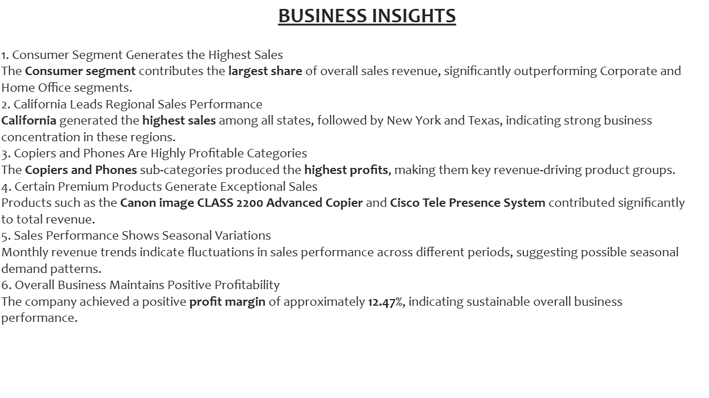
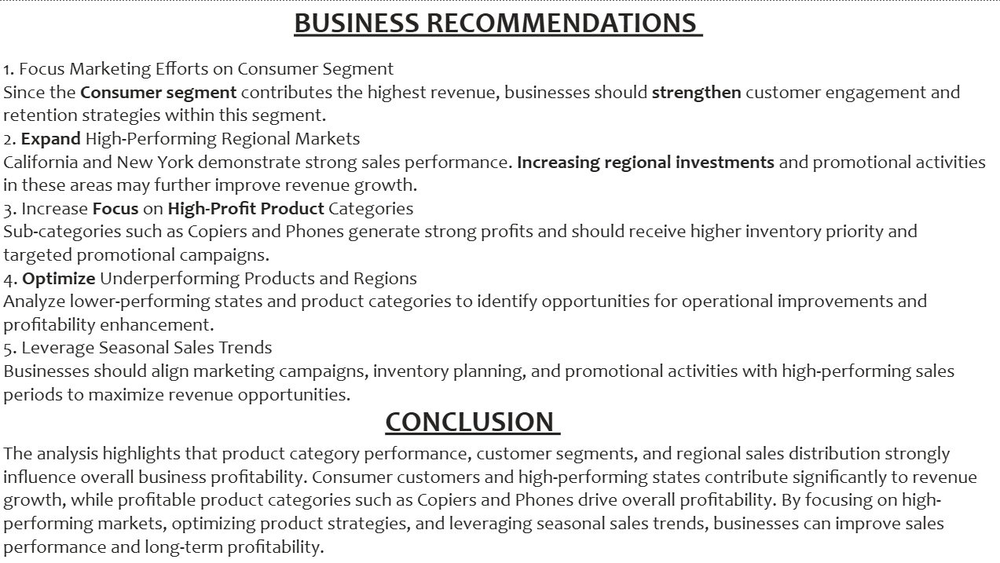

# FUTURE_DS_01
FUTURE_DS_01 – A data science learning repository containing datasets, exploratory analysis, visualizations, and project tasks.
# FUTURE_DS_01
# Business Sales Analysis Dashboard

## Project Overview
This project is an interactive Power BI dashboard developed using the Superstore dataset to analyze sales performance, profitability, customer segments, products, and regional trends.

The dashboard provides business insights through KPI tracking, trend analysis, profitability analysis, and strategic recommendations to support data-driven decision-making.

---

# Dashboard Objectives
- Analyze overall sales and profit performance
- Identify top-performing products and categories
- Evaluate regional sales distribution
- Compare customer segment profitability
- Detect seasonal sales trends
- Generate actionable business insights and recommendations

---

# Tools & Technologies Used
- Power BI
- Microsoft Excel
- Pivot Tables
- Data Visualization

---

# Dashboard Features

## Page 1 – Executive Overview
- KPI Cards
  - Total Sales
  - Total Profit
  - Total Orders
  - Total Quantity
  - Profit Margin
- Sales Trend Analysis
- Profit by Sub-Category
- Regional Sales Map
- Sales by Segment Analysis
- Interactive Slicers

## Page 2 – Business Analytics
- Sales vs Profit Scatter Analysis
- Top Products Treemap
- Sales & Profit Trends
- Category Performance Analysis
- Segment Profitability Analysis

## Page 3 – Business Insights
- Key business findings
- Regional performance insights
- Product profitability insights
- Seasonal trend analysis
- Customer segment analysis

## Page 4 – Recommendations & Conclusion
- Strategic business recommendations
- Growth opportunities
- Profitability improvement suggestions
- Final business conclusion

---

# Key Business Insights
- Consumer segment generates the highest sales contribution.
- California leads regional sales performance.
- Copiers and Phones are the most profitable sub-categories.
- Technology products contribute the highest revenue.
- Sales steadily increased from 2014–2017.
- Certain furniture categories generate lower profitability.

---

# Business Recommendations
- Increase focus on high-profit technology products.
- Optimize pricing strategies for low-profit categories.
- Expand marketing efforts in high-performing regions.
- Improve inventory planning during peak sales periods.
- Strengthen customer targeting strategies.
## Dashboard Preview

## Insights Page

## Skills Demonstrated

- Data Cleaning
- KPI Analysis
- Customer Segmentation
- Power BI Dashboard Design
- Business Insights & Recommendations
- Data Storytelling

---

# Conclusion
The analysis demonstrates strong sales growth, healthy profitability, and high-performing technology product categories. The dashboard successfully identifies revenue drivers, profitability trends, and business opportunities that support strategic decision-making and business growth.

---

## Project Files

- [BUSINESS SALES ANALYSIS.pbix](Business%20Sales%20Analysis%20.pbix)
- [RAW DATA.xlsx](RAW%20DATA.xlsx)
- [README.md](README.md)

# Author
Prepared by: Pampati Vignesh
